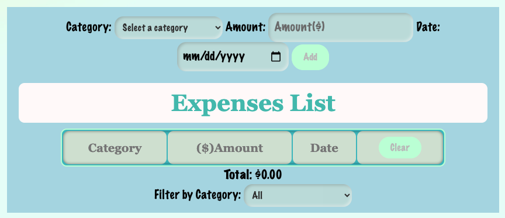
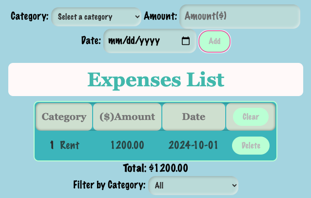
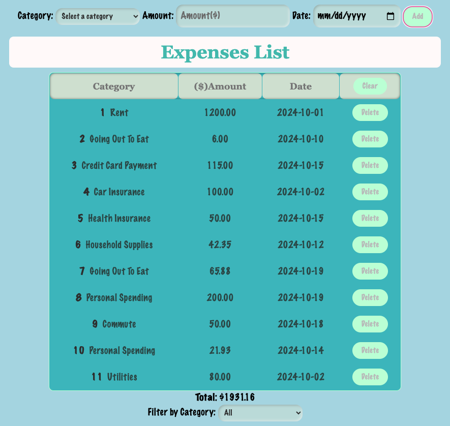
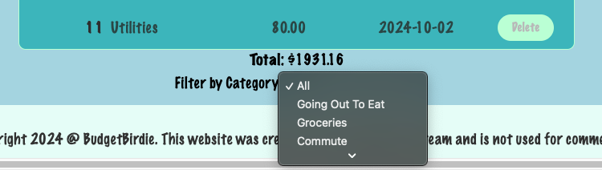
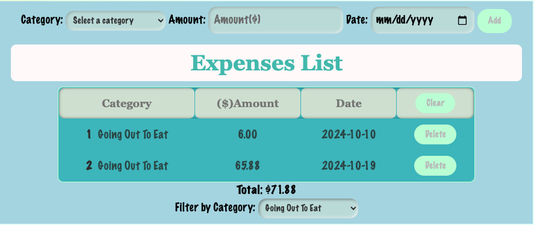

# <BUDGET_BIRDiE>

## Description

The BUDGET BIRDiE Expense Tracker is an application that allows it's users to monitor, manage and track their financial transactions by category, amount and date with the ability to also delete added items to edit or correct input data. 
The application uses HTML, CSS Style Sheet, Bootstrap CSS Framework, and JavaScript. <br />
<br />
The motivation for this project comes from the desire to help individuals who struggle with finances and financial planning develop financial awareness habits in order to achieve long-term financial goals with a user-friendly website so it is accessible to all.
The tracker allows the user to track everyday spending with the capability of filtering listed items so they can identift where their funds are being allocated so that a budget can be created. <br />
<br />
This project allowed our team to learn what is needed to collaborate on the development of a functional front-end web application. We were able to navigate the project together to meet the acceptance criteria all the while learning through trial and error what methods are needed and better organizational skills for future projects.

## Installation

**Follow these steps to install BUDGET BIRDiE** <br />
<br />
**Installation Prerequisites** <br />
<br />
You will need to make sure you have the following installed <br />
<br />
**Visual Studio Code** <br />
Click [here](https://code.visualstudio.com/download) to download VS Code <br />
<br />
**Git** <br />
Click [here](https://docs.github.com/en/get-started/getting-started-with-git/set-up-git) and follow the steps to download, install, and configure Git on your computer. <br />
<br />
**SSH Key** <br />
Click [here](https://docs.github.com/en/authentication/connecting-to-github-with-ssh/generating-a-new-ssh-key-and-adding-it-to-the-ssh-agent) for the installation process to generate your SSH key and add it to ssh-agent <br />
<br />
**Use the following command prompts to install BUDGET BIRDiE Repo on your computer**<br />
<br />
You will first need to clone the repo by entering the following code into your terminal: <br />
<br />

```
$ git clone git@github.com:Rtrieu1993/budgetbirdie.github.io.git
```

<br />

You will then want to navigate to the BUDGET BIRDiE directory with the following command:<br />

```
$ cd budgetbirdie.github.io
```

<br />
Then open the repo in your VS Code by using the following command:<br />
<br />

```
$ code .
```

<br />
From there you can view the entire repo and all of it's content. You can also deploy the application from the HTML file in your default browser. <br />


## Usage

**Refer to the following step-by-step walkthrough with screenshot examples:**

Navigate to the expense tracker on the home screen.
<br />

<br />
From there you will select the type of expense you are adding to your tracker.
<br />

<br />
Once the category is selected you will enter the amount paid and the date. 
<br />

<br />
After you have added all relevant expenses you will see them listed on a table with a totaled dollar amount on the bottom. If needed, you will notice you are able to delete items off the table as well. 
<br />

<br />
You will also notice a filter by category drop down.
<br />

<br />
Once you have selected the desired categroy, the table will list all added items for that expense and the total amount paid.
<br />



## Credits

Richard Treau <br />
Adriana Hernandez <br />
Chris Long <br />
Prishant Tiwari 

## Features

**BUDGET BIRDiE Features**
<br />
*Track your daily expenses to a table that shows the date of transaction and the amount paid.
*Delete unecessary expenses off the table
*Clear entire table
*Filter by expense category
*Calculates total amount paid for listed expenses